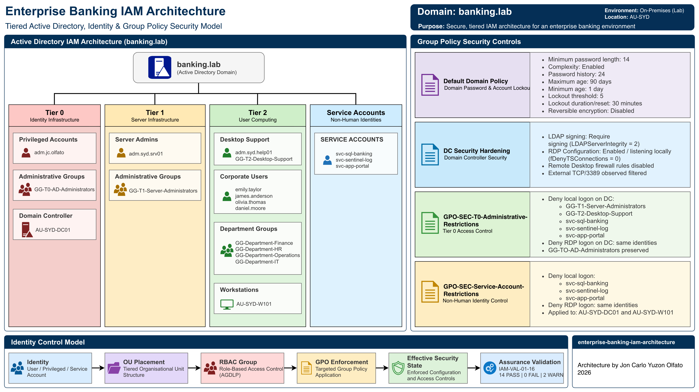

# Enterprise Banking IAM Architecture


> Enterprise IAM architecture implementing tiered Active Directory administration, RBAC, automated identity provisioning, Group Policy enforcement and independent security assurance.

A tiered Microsoft Active Directory Identity and Access Management architecture designed for an enterprise banking lab environment, implementing privileged access separation, Role-Based Access Control (RBAC), automated identity provisioning, Group Policy security controls and independent security assurance.

The project demonstrates the design, implementation and validation of an identity control model across privileged administrators, corporate users, service accounts and managed infrastructure within the `banking.lab` domain.

## Architecture Overview



The architecture applies a tiered administrative model to separate identity administration, server administration and end-user computing responsibilities.

| Security Tier | Administrative Scope | Representative Control |
| --- | --- | --- |
| Tier 0 | Identity infrastructure | Domain and identity administration |
| Tier 1 | Server infrastructure | Server administration |
| Tier 2 | User computing | Desktop support and corporate access |

The implemented environment integrates Active Directory organisational structure, security groups, controlled identities, Group Policy enforcement and a read-only assurance framework into a single IAM control architecture.

## Project Overview

The project models IAM engineering within a fictional enterprise banking environment where privileged access, standard workforce identities and non-human service identities require explicit separation and controlled administrative boundaries.

The implementation was developed within the isolated `banking.lab` Active Directory environment hosted on `AU-SYD-DC01`.

The project follows four architectural phases:

### Design → Provision → Enforce → Assure

The resulting implementation includes:

- 14 project-defined Organisational Units
- 11 project-defined Global Security groups
- 10 controlled identities
- three administrative security tiers
- departmental RBAC
- dedicated privileged administrative identities
- dedicated service identities
- PowerShell-based provisioning
- Group Policy security controls
- 16 independent IAM assurance checks

## Security Objectives

The architecture was designed to demonstrate the following IAM security objectives:

- separate privileged administration from standard user access;
- establish Tier 0, Tier 1 and Tier 2 administrative boundaries;
- implement role-based access through designated security groups;
- separate human, privileged and non-human identities;
- restrict interactive use of service identities;
- protect Tier 0 administrative capability from lower-tier access;
- enforce domain-level account security requirements;
- strengthen Domain Controller LDAP security;
- automate repeatable identity infrastructure provisioning; and
- independently validate the final IAM state against the claimed architecture.

## Identity Architecture

The Active Directory design separates identity and infrastructure objects through a structured OU hierarchy within:

`DC=banking,DC=lab`

The architecture distinguishes four principal identity classes:

| Identity Class | Purpose | Count |
| --- | --- | ---: |
| Tiered privileged accounts | Administrative operations | 3 |
| Standard corporate users | Departmental workforce access | 4 |
| Service accounts | Non-human application and logging functions | 3 |
| **Total controlled identities** | | **10** |

### Privileged Administration

Dedicated administrative identities are separated by security tier.

| Identity | Tier | Designated Administrative Group |
| --- | --- | --- |
| `adm.jc.olfato` | Tier 0 | `GG-T0-AD-Administrators` |
| `adm.syd.srv01` | Tier 1 | `GG-T1-Server-Administrators` |
| `adm.syd.help01` | Tier 2 | `GG-T2-Desktop-Support` |

This model prevents the project from treating administrative access as a single undifferentiated privilege level.

Tier 0 represents the highest-trust identity administration boundary and is preserved separately from Tier 1 and Tier 2 administrative access.

### Corporate Identities

Standard workforce identities are assigned to departmental RBAC groups.

| Identity | Department | Designated RBAC Group |
| --- | --- | --- |
| `emily.taylor` | Finance | `GG-Department-Finance` |
| `james.anderson` | HR | `GG-Department-HR` |
| `olivia.thomas` | Operations | `GG-Department-Operations` |
| `daniel.moore` | IT | `GG-Department-IT` |

### Service Identities

Three dedicated non-human identities support representative enterprise services:

- `svc-sql-banking`
- `svc-sentinel-log`
- `svc-app-portal`

The service identities are separated from normal workforce identities and are subject to dedicated interactive-logon restrictions through Group Policy.

## Role-Based Access Control

The RBAC model uses project-defined Global Security groups to represent administrative tiers and departmental roles.

The implementation contains 11 controlled security groups distributed across:

- Tier 0 identity administration;
- Tier 1 infrastructure administration;
- Tier 2 desktop support; and
- Finance, HR, IT and Operations departmental access.

Identity provisioning assigns controlled identities to their designated project security groups rather than representing role assignment through individual user-specific access mappings.

Detailed group design and membership relationships are documented in: [RBAC Model](documentation/rbac-model.md)

## Group Policy Security Controls

Group Policy provides the enforcement layer between the logical IAM design and the effective security state of the domain.

### Domain Account Policy

The existing `Default Domain Policy` enforces the domain account requirements.

| Control | Implemented State |
| --- | --- |
| Minimum password length | 14 characters |
| Password complexity | Enabled |
| Password history | 24 passwords |
| Maximum password age | 90 days |
| Minimum password age | 1 day |
| Account lockout threshold | 5 attempts |
| Account lockout duration | 30 minutes |
| Lockout observation/reset window | 30 minutes |
| Reversible encryption | Disabled |

### Domain Controller Security

`DC Security Hardening` requires LDAP signing on `AU-SYD-DC01` using:

`LDAPServerIntegrity = 2`

This requires LDAP signing for applicable LDAP communications with the Domain Controller.

### Administrative and Service Logon Restrictions

Two additional security policies enforce IAM-specific administrative boundaries:

- `GPO-SEC-T0-Administrative-Restrictions`
- `GPO-SEC-Service-Account-Restrictions`

The controls restrict lower-tier administrative and service identities from interactive and Remote Desktop logon where required while preserving Tier 0 administrative access.

The service-account restrictions apply to both:

- `AU-SYD-DC01`
- `AU-SYD-W101`

Detailed implementation and validation are documented in: [Group Policy Security Controls](documentation/gpo-security-controls.md)

## Automation

PowerShell automation supports repeatable provisioning of the IAM architecture.

| Artefact | Purpose | Behaviour |
| --- | --- | --- |
| `New-BankingOU.ps1` | Provisions the OU architecture | State-changing |
| `New-BankingSecurityGroups.ps1` | Provisions project RBAC groups | State-changing |
| `Import-BankingUsers.ps1` | Provisions identities and RBAC membership | State-changing |
| `employees.csv` | Defines the controlled identity population | Declarative input |
| `Test-BankingIAMArchitecture.ps1` | Validates final architecture conformance | Read-only |

Identity provisioning uses `SamAccountName` to identify existing controlled accounts before creation.

The implemented provisioning behaviour is:

```text
Account does not exist → CREATE
Account already exists → SKIP
```

Historical validation confirmed that a subsequent provisioning execution detected and skipped all 10 existing controlled identities without provisioning-validation failures.

The complete automation and execution model is documented in: [Automation and Assurance Tooling](scripts/README.md)

## Security Assurance

The completed environment was independently assessed using the read-only `Test-BankingIAMArchitecture.ps1` assurance framework.

The framework evaluates 16 controls covering:

- OU architecture;
- identity population and classification;
- RBAC;
- privileged tiering;
- privileged-account controls;
- service-account controls;
- GPO architecture and precedence;
- domain account policy;
- LDAP signing;
- service logon restrictions;
- Tier 0 protection;
- RDP exposure;
- provisioning integrity; and
- aggregate architecture conformance.

### Final Assurance Result

| Result | Count |
| --- | ---: |
| PASS | 14 |
| FAIL | 0 |
| WARN | 2 |

### Overall result: WARN

There were **zero mandatory IAM assurance failures**.

The result contains one residual technical observation: `IAM-VAL-14 — RDP Exposure`.

RDP is enabled and listening locally on `AU-SYD-DC01`; however, the standard Remote Desktop firewall rules remain disabled and independent network validation from `au-syd-secops01` observed TCP/3389 as filtered.

`IAM-VAL-16 — Architecture Conformance` inherits the WARN state from the aggregate assurance result. It does not represent a second independent technical deficiency.

The IAM deny-logon controls remain effective independently of the observed RDP configuration.

Detailed assurance methodology and evidence are documented in: [IAM Security Validation](documentation/iam-security-validation.md)

## Evidence

The repository maintains implementation and validation evidence separately to preserve the distinction between historical deployment activity and final-state assurance.

Key evidence areas include:

| Evidence Area | Location |
| --- | --- |
| OU provisioning | [Provisioning Log](evidence/ou-provisioning-log.md) |
| RBAC provisioning | [Provisioning Log](evidence/rbac-provisioning-log.md) |
| Identity provisioning | [Provisioning Log](evidence/user-provisioning-log.md) |
| OU architecture | [`screenshots/organisational-units/`](screenshots/organisational-units/) |
| Security groups | [`screenshots/security-groups/`](screenshots/security-groups/) |
| Controlled identities | [`screenshots/active-directory-users/`](screenshots/active-directory-users/) |
| Provisioning automation | [`screenshots/powershell/`](screenshots/powershell/) |
| Group Policy controls | [`screenshots/group-policy/`](screenshots/group-policy/) |
| Final IAM assurance | [`screenshots/validation/`](screenshots/validation/) |

Historical evidence is retained as implementation history rather than rewritten to reflect later configuration states.

## Repository Structure

```text
enterprise-banking-iam-architecture/
├── assets/
├── configuration/
│   ├── security-groups.md
│   └── user-account-model.md
├── diagrams/
│   ├── enterprise-banking-iam-architecture.drawio
│   └── enterprise-banking-iam-architecture.png
├── documentation/
│   ├── gpo-security-controls.md
│   ├── iam-security-validation.md
│   ├── identity-lifecycle-management.md
│   └── rbac-model.md
├── evidence/
│   ├── ou-provisioning-log.md
│   ├── rbac-provisioning-log.md
│   └── user-provisioning-log.md
├── screenshots/
│   ├── active-directory-users/
│   ├── group-policy/
│   ├── organisational-units/
│   ├── powershell/
│   ├── security-groups/
│   └── validation/
├── scripts/
│   ├── README.md
│   └── powershell/
│       ├── Import-BankingUsers.ps1
│       ├── New-BankingOU.ps1
│       ├── New-BankingSecurityGroups.ps1
│       ├── Test-BankingIAMArchitecture.ps1
│       └── employees.csv
├── LICENSE
└── README.md
```

## Technical Environment

| Component | Implementation |
| --- | --- |
| Directory service | Microsoft Active Directory Domain Services |
| Domain | `banking.lab` |
| Domain Controller | `AU-SYD-DC01` (`10.10.10.10`) |
| Corporate workstation | `AU-SYD-W101` (`10.10.10.30`) |
| Security validation host | `au-syd-secops01` (`10.10.10.40`) |
| Automation | Windows PowerShell |
| Policy enforcement | Group Policy |
| Virtualisation | UTM |
| Network | Isolated host-only lab network |

The project operates within an isolated laboratory environment and is not connected to a production banking network.

## Key Outcomes

The project demonstrates the ability to translate IAM security requirements into an implemented and independently validated Active Directory architecture.

Key outcomes include:

- designed and provisioned a tiered enterprise OU architecture;
- established explicit Tier 0, Tier 1 and Tier 2 administrative boundaries;
- implemented RBAC through controlled Global Security groups;
- separated privileged, standard and service identities;
- automated repeatable identity infrastructure provisioning with PowerShell;
- enforced IAM-specific account and logon controls through Group Policy;
- required LDAP signing on the Domain Controller;
- preserved Tier 0 administrative access while restricting lower-trust identities;
- separated state-changing provisioning from read-only security assurance; and
- completed final architecture assurance with 14 PASS, 0 FAIL and 2 WARN results representing zero mandatory IAM failures and one residual technical observation.

## Project Scope and Boundaries

This repository focuses specifically on enterprise Identity and Access Management architecture.

It does not represent a complete production banking security environment.

The project intentionally does not attempt to provide:

- production Active Directory deployment guidance;
- comprehensive Windows Server hardening;
- Security Information and Event Management engineering;
- offensive Active Directory security testing;
- production secrets or credential-management infrastructure;
- ACSC Essential Eight assessment; or
- APRA CPS 234 compliance assessment.

Broader security monitoring, governance, risk and compliance activities are treated as separate portfolio workstreams rather than being retrofitted into this IAM implementation.

## Documentation

Detailed project documentation is maintained separately from the root README:

| Document | Purpose |
| --- | --- |
| [RBAC Model](documentation/rbac-model.md) | RBAC architecture and security-group design |
| [Identity Lifecycle Management](documentation/identity-lifecycle-management.md) | Identity lifecycle and account-management model |
| [Group Policy Security Controls](documentation/gpo-security-controls.md) | Group Policy security implementation and validation |
| [IAM Security Validation](documentation/iam-security-validation.md) | Final IAM assurance methodology and results |
| [Security Groups](configuration/security-groups.md) | Defined project security-group configuration |
| [User Account Model](configuration/user-account-model.md) | Controlled identity model |
| [Automation and Assurance Tooling](scripts/README.md) | Automation, provisioning and assurance tooling |

## License

This project is licensed under the MIT License. See `LICENSE` for the complete licence terms.
